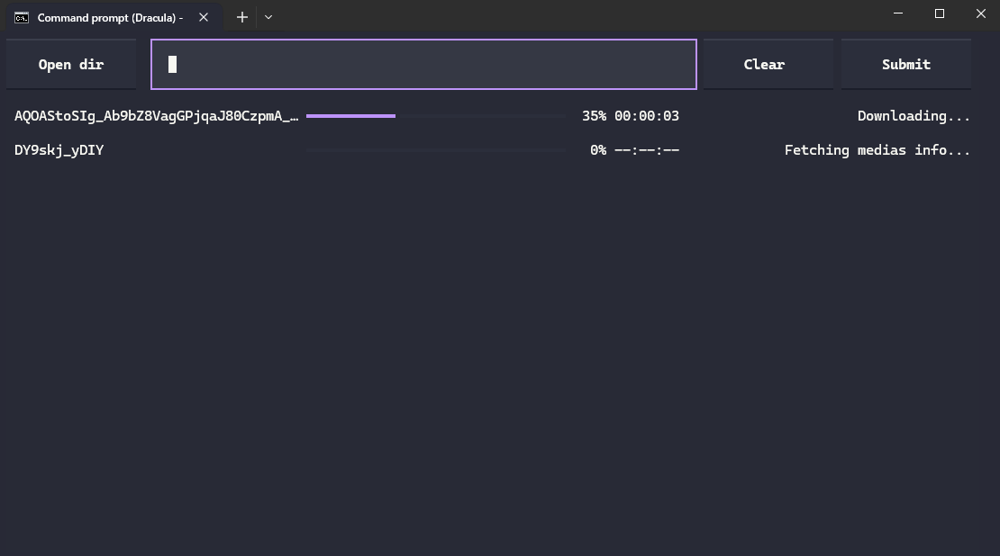

# igdl-textual

This is a multithreading TUI Instagram reels downloader, simply paste the link and click "Submit" and it will be downloaded into the `downloads` folder (You can open that folder by clicking the "Open dir" button)

## Setting up environment

I usually do `python -m venv venv` and then run `activate`

Then install the dependencies inside the `venv` with `pip install pip-freeze.txt`

(And yes I didn't use `pipreqs` to generate it...)

## How to use

⚠️ **Disclaimer: Use this tool at your own risk. Downloading too many reels in a short period of time may trigger Instagram/Meta rate limits, account flags, temporary restrictions, or account suspension. You are responsible for how you use this tool, and the author is not responsible for any action taken against your account.** ⚠️

1. Run [get-settings.py](./get-settings.py) to generate the cookies etc
2. Type your account & password, 2FA code it's enabled
3. Wait until you see "--- End of Program---" and a `settings.json` being generated
4. Run [main.py](./main.py)
